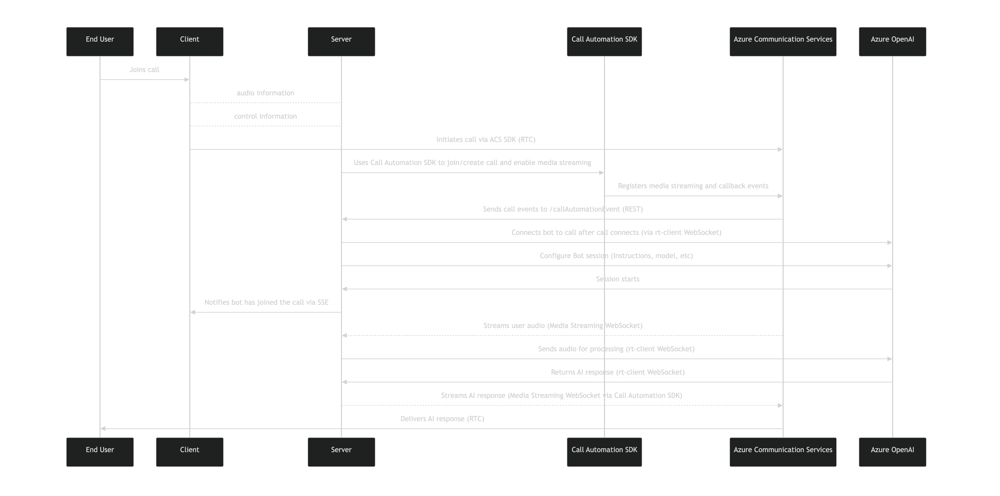

# Azure Communication Services OpenAI Calling Sample

This sample is a web application that demonstrates how to integrate Azure Communication Services calling with Azure OpenAI for real-time AI agent interaction during a live call.

## Features

- **Real-time AI Agent**: Connects a live call to an AI agent powered by Azure OpenAI for intelligent, real-time responses.
- **Advanced Call Automation**: Uses the Azure Communication Services [Call Automation SDK](https://learn.microsoft.com/azure/communication-services/concepts/call-automation/call-automation) to manage call flows and media streaming.
- **Real-time Audio Processing**: Integrates the `rt-client` package for real-time audio streaming and processing, enabling low-latency AI interactions during calls. See the [aoai-realtime-audio-sdk releases page](https://github.com/Azure-Samples/aoai-realtime-audio-sdk/) for details.
- **Live Status Updates**: Leverages Server-Sent Events (SSE) to push real-time status updates (e.g., "Agent is connected") from the server to the client.
-**Modern UI**: A responsive and mobile-friendly user interface built with React and Fluent UI.
- **Open Source & Customizable**: The app is fully customizable, allowing you to adapt the AI agent's behavior and the UI to your needs.

## Code Structure

### Frontend (Client)
- React: A JavaScript library for building the user interface.
- TypeScript: A typed superset of JavaScript for building robust, scalable applications.
- Fluent UI: A Microsoft-designed UI component library for creating a modern and responsive user experience.
- Azure Communication Services (ACS) Calling SDK: A client-side library for managing the user's connection to the call and handling local audio streams directly from the browser.

### Backend (Server)
- Node.js & Express.js: A JavaScript runtime and web framework used to create the API, host the Call Automation callback endpoint, and manage the media streaming WebSocket.
- Azure Communication Services (ACS) Call Automation SDK: The core server-side library for orchestrating the call. It allows the server to programmatically create calls, add participants, and, most importantly, start and stop real-time media streaming. It is the bridge between the ACS platform and the server's business logic.
- rt-client: A specialized client library for streaming audio to and from the Azure OpenAI real-time audio API. It handles the low-level WebSocket connection and message formatting required by the OpenAI service.


At a summary level, the architecture of this experience looks something like the following:



## Local Setup

### Prerequisites

- An Azure account with an active subscription. [Create an account for free](https://azure.microsoft.com/free/).
- An active Communication Services resource. [Create a Communication Services resource](https://docs.microsoft.com/azure/communication-services/quickstarts/create-communication-resource).
- An active Azure OpenAI resource with a model deployed (e.g., `gpt-4o-realtime-preview` `gpt-4o-mini-realtime-preview`). See [instructions](https://learn.microsoft.com/en-us/azure/ai-foundry/openai/how-to/create-resource?pivots=web-portal)
- [Node.js (22.0.0 and above)](https://nodejs.org/en/download/)
- The `rt-client` package, which is required for real-time audio processing from the [aoai-realtime-audio-sdk releases page](https://github.com/Azure-Samples/aoai-realtime-audio-sdk/).
- For local development, Azure Dev Tunnels. For details, see [Enable dev tunnel](https://learn.microsoft.com/en-us/azure/developer/dev-tunnels/get-started).


### Setup and Run

You can run the sample in two ways: **locally** (using Azure DevTunnel) or **in GitHub Codespaces**.

#### 0. Environment Variables

Create a `.env` file in the `/server` directory. You can use the `.env.template` file as a template.

The following environment variables are required:

-   `RESOURCE_CONNECTION_STRING`: Your [Azure Communication Services](https://learn.microsoft.com/en-us/azure/communication-services/quickstarts/create-communication-resource?tabs=windows&pivots=platform-azp) connection string.
-   `ENDPOINT_URL`: The endpoint URL for your [Azure Communication Services](https://learn.microsoft.com/en-us/azure/communication-services/quickstarts/create-communication-resource?tabs=windows&pivots=platform-azp) resource.
-   `AZURE_OPENAI_SERVICE_KEY`: The API key for your Azure OpenAI service. See [instructions](https://learn.microsoft.com/en-us/azure/ai-foundry/openai/how-to/create-resource?pivots=web-portal)
-   `AZURE_OPENAI_SERVICE_ENDPOINT`: The endpoint for your Azure OpenAI service.
-   `AZURE_OPENAI_SERVICE_DEPLOYMENT_MODEL_NAME`: The name of your [deployed OpenAI model](https://learn.microsoft.com/en-us/azure/ai-foundry/openai/concepts/models?tabs=global-standard%2Cstandard-chat-completions#model-summary-table-and-region-availability). i.e. gpt-4o-realtime-preview, gpt-4o-mini-realtime-preview
-   `AZURE_OPENAI_PROMPT_INSTRUCTIONS`: The system prompt/instructions for the Azure OpenAI assistant. If not provided, a default prompt will be used.
-   `SERVER_CALLBACK_URI`: Set value after Devtunnel is created and hosted. The publicly accessible URL for your server, used for Call Automation callbacks. For local development, you can use a tunneling service like [Azure Devtunnels](https://learn.microsoft.com/en-us/azure/developer/dev-tunnels/get-started?tabs=macos).
-   `CLIENT_ORIGIN_URL`: The origin URL of your client application (e.g., `http://localhost:3000` for local development or your Codespaces/GitHub Codespaces URL). This is required for CORS configuration to allow your frontend to communicate with the backend.

**Note:**  
Set `SERVER_CALLBACK_URI` and `CLIENT_ORIGIN_URL` values after Devtunnel is created and hosted. For Codespace, these values are set by adding `8080` and `3000` ports.

#### 1. Local Development (using Azure DevTunnel)

**Step 1: Install dependencies**

From the **root of the project folder**, run:

```bash
npm run setup
```

**Step 2: Install Azure DevTunnel CLI**  
If you haven't already, follow the instructions at [Enable dev tunnel](https://learn.microsoft.com/en-us/azure/developer/dev-tunnels/get-started) to install the DevTunnel CLI.

**Step 3: Create your DevTunnel (run once):**  
You only need to run these commands once to create your tunnel and expose port 8080:

```bash
devtunnel create --allow-anonymous
devtunnel port create -p 8080
```

**Step 4: Start your DevTunnel host (run every time you start development):**  
Each time you start a new development session, run in a new terminal window:

```bash
devtunnel host
```

This will make your local server accessible via the public DevTunnel URL.
After running devtunnel host, DevTunnel will display a public URL in the following format:

```
https://<your-tunnel-id>-8080.<region>.devtunnels.ms
```

For example:

```
https://0a1bc23d-8080.usw2.devtunnels.ms
```

**Copy this URL**—you will use it as your `SERVER_CALLBACK_URI` `.env` environment variable.

**Step 5: Start the sample**

From the **root of the project folder**, run:

```bash
npm run start
```

The client development server will run on port 3000 and proxy API requests to the server on port 8080.

**Step 6: Open the App**
Open a new browser page to `http://localhost:3000`


---

#### 2. Codespaces Development

**Step 1: Install dependencies**

From the **root of the project folder**, run:

```bash
npm run setup
```

**Step 2: Open your Codespace**  
Add port 8080 for the server and add port 3000 for the client
Codespaces will generate URLs like:  
- `https://<your-codespace-id>-8080.app.github.dev` (server)
- `https://<your-codespace-id>-3000.app.github.dev` (client)

**Step 3: Open your Codespace**  
Set port visibility to Public for the port 8080 (server) forwarded address

**Step 4: Set client and server url environment variables:**  
- Set `SERVER_CALLBACK_URI` to your Codespace public server URL (e.g., `https://<your-codespace-id>-8080.app.github.dev`).
- Set `CLIENT_ORIGIN_URL` to your Codespace public client URL (e.g., `https://<your-codespace-id>-3000.app.github.dev`).

**Step 5: Start the sample**

From the **root of the project folder**, run:

```bash
npm run start
```

The client development server will run on port 3000 and proxy API requests to the server on port 8080.


**Step 6: Open the browser page**  
Open the client url on a browser window to open the app.
If you already have the client url open then you may need to refresh the browser page for the client to ensure the new environment variables are applied correctly or terminate and restart the app like on step 5.

---

**Note:**  
Make sure your CORS configuration in the server includes the correct `CLIENT_ORIGIN_URL` for your environment (local or Codespaces).


## Trademark

This project may contain trademarks or logos for projects, products, or services. Authorized use of Microsoft trademarks or logos is subject to and must follow [Microsoft’s Trademark & Brand Guidelines](https://www.microsoft.com/legal/intellectualproperty/trademarks/usage/general). Use of Microsoft trademarks or logos in modified versions of this project must not cause confusion or imply Microsoft sponsorship. Any use of third-party trademarks or logos are subject to those third-party’s policies.

## License

This project is licensed under the MIT License. See the [LICENSE](LICENSE.md) file for details.